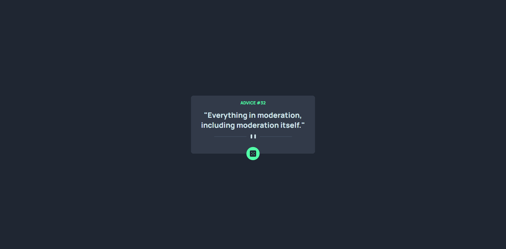
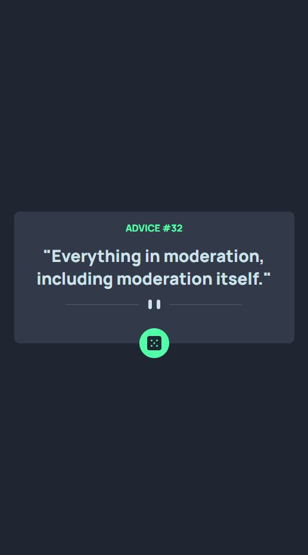

# Advice generator app solution

This is a solution to the [Advice generator app challenge on Frontend Mentor](https://www.frontendmentor.io/challenges/advice-generator-app-QdUG-13db).

## Table of contents

- [Overview](#overview)
  - [The challenge](#the-challenge)
  - [Screenshot](#screenshot)
  - [Links](#links)
- [My process](#my-process)
  - [Built with](#built-with)
- [Author](#author)

## Overview

### The challenge

Users should be able to:

- View the optimal layout for the app depending on their device's screen size
- See hover states for all interactive elements on the page
- Generate a new piece of advice by clicking the dice icon

### Screenshot

| Desktop Preview                                       | Mobile Preview                                       |
| ----------------------------------------------------- | ---------------------------------------------------- |
|  |  |

### Links

- Solution URL: [advice-generator-app](https://github.com/Dalcio/advice-generator-app)
- Live Site URL: [Advice Generator App](http://get-advice.vercel.app)

## My process

### Built with

- Mobile-first workflow
- [React](https://reactjs.org/) - JS library
- [Next.js](https://nextjs.org/) - React framework
- [Stitches](advice-generator-app) - For styles
- [Advice Slip JSON API](https://api.adviceslip.com/) - The Advice Slip JSON API is provided for freeThe API

## Author

- Website - [Dálcio Garcia](https://dalciogarcia.vercel.app)
- Frontend Mentor - [@Dalcio](https://www.frontendmentor.io/profile/dalcio)
- Linkedin - [dalcio-garcia](https://www.linkedin.com/in/dalcio-garcia)
